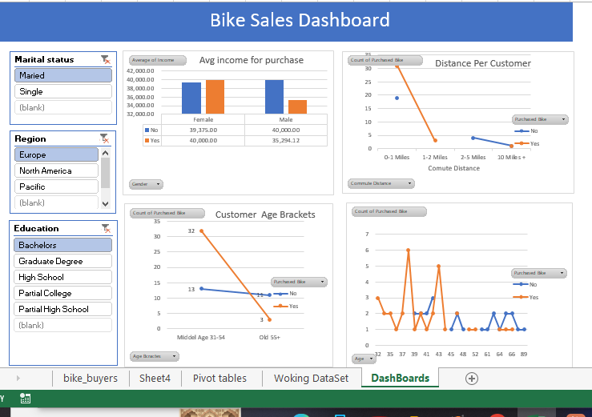

 Bike_Sales_Analysis_Using_Excel

 📌 Project Overview
An Excel-based Bike Sales Analysis project to understand customer purchasing patterns and identify factors related to bike purchases.

## 🛠️ Tools & Skills
- Microsoft Excel
- Data Cleaning
- Pivot Tables
- Pivot Charts
- Slicers
- Data Visualization
- Dashboard Creation

## 📊 Analysis
The project analyzes:
- Customer demographics
- Income and age
- Commute distance
- Education and occupation
- Bike buyers vs. non-buyers

## 📈 Dashboard

## 📁 Files
- `Bike_Sales_Analysis.xlsx` – Complete Excel analysis workbook
- `Bike_sales_DashboardImage.png` – Dashboard preview

**Project Type:** Data Analyst Portfolio Project
